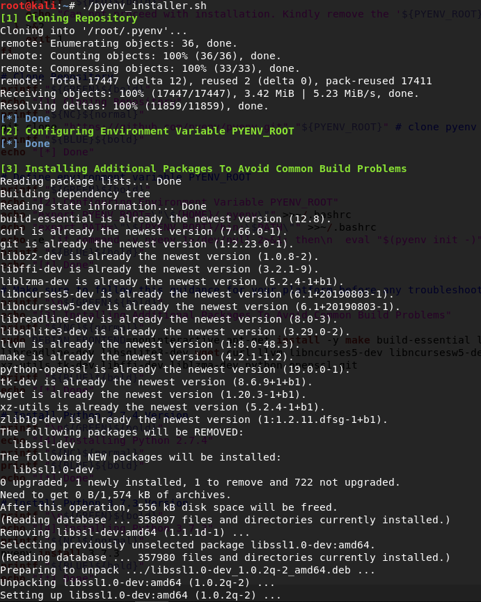
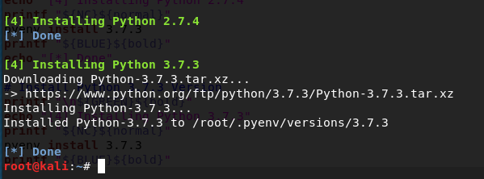

# Pyenv Installer

This script will automates the installation of pyenv for kali linux. This will install python versions 2.7.4 and 3.7.3

### Launching the program

compile the program with chmod +x and run.

### Sample Output

### Built With

* Python 2.7.14

### Authors

*** Zach Fleming --> zflemingg1@gmail.com

